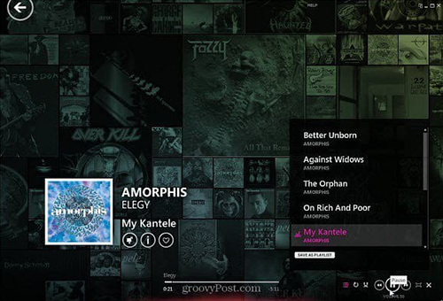

> Web-based Spotify display for your living room TV.

[](https://travis-ci.org/cdtinney/spune) [](https://coveralls.io/github/cdtinney/spune?branch=develop)

## Table of Contents

- [Table of Contents](#table-of-contents)
- [Introduction](#introduction)
  - [Inspiration](#inspiration)
- [Developing](#developing)
  - [Requirements](#requirements)
  - [Installing](#installing)
  - [Creating Spotify Client ID](#creating-spotify-client-id)
  - [Setting Environment Variables](#setting-environment-variables)
  - [Running](#running)
  - [Stopping](#stopping)
  - [Testing](#testing)
    - [Server](#server)
    - [Client](#client)
    - [Coveralls](#coveralls)
  - [Building](#building)
  - [Deploying](#deploying)
  - [Debugging](#debugging)
    - [Heroku](#heroku)
  - [Database](#database)
    - [Development](#development)
    - [Production](#production)
- [Thanks to..](#thanks-to)

## Introduction

Spune is a simple "Now Playing" visualizer for Spotify, inspired by desktop Zune software.

### Inspiration

Inspiration for building this is as follows:

1. Desktop Zune software is awesome to look at on your TV
2. Desktop Spotify software sucks to look at on your TV
1. Therefore, a client that shows what you're listening to in the style of Zune
must be awesome

Here are some screenshots of the glory that is Zune:




## Developing

### Requirements

To run the application:

* [Node.js/npm](https://nodejs.org/en/)
* [Configured Spotify application](https://developer.spotify.com/dashboard/login)
* [MongoDB](https://www.mongodb.org/downloads)

For CI/CD:

* [Travis CI CLI](https://github.com/travis-ci/travis.rb#readme)
* [Heroku CLI](https://devcenter.heroku.com/articles/heroku-cli)

### Installing

Clone the repository (and navigate into it):

```
$ git clone git@github.com:cdtinney/spune.git
$ cd spune
```

Install dependencies for both server and client:

```
$ npm install
$ cd client && npm install
```

### Creating Spotify Client ID

* Login to [the Spotify developer dashboard](https://developer.spotify.com/dashboard/applications)
* Create a new Client ID
  * Keep the page open so you can copy/paste the ID and secret next

### Setting Environment Variables

Create an `.env` file in the root directory, and set these **required** variables (for a local environment):

```
CLIENT_HOST = http://localhost:3000
SPOT_REDIRECT_URI = http://localhost:5000/api/callback
SPOT_CLIENT_ID = <CLIENT_ID>
SPOT_CLIENT_SECRET = <CLIENT_SECRET>
SESSION_SECRET = <SESSION_SECRET_STRING> # This can be anything
```

In production, replace `localhost:port` with the URL it's being hosted at.

There are also optional variables:

```
MONGODB_URI = <MONGODB_URI> # Defaults to mongodb://localhost:27107:spune
```

### Running

First, **ensure that the MongoDB daemon is running** (e.g. run `mongod` in a separate terminal).

To run both client and server:

```
$ npm run dev
```

To run client only:

```
$ npm run client
```

To run server only (watch mode):

```
$ npm run server:watch
```

To run server only (non-watch mode):

```
$ npm run server
```

### Stopping

To stop a running development server, use `Ctrl+C` to gracefully shut it down.

If you accidentally use `Ctrl+Z`, you will have to manually kill the old processes to free up the ports.
This can be done via finding the process IDs (PIDs):

```
$ ps -A | egrep "start.js|app.js"
$ kill -9 <SERVER_PID> <CLIENT_PID>
```

### Testing

To run all tests with coverage:

```
$ npm run test
```

#### Server

To run server tests in watch mode:

```
$ npm run server:test
```

To run server tests with coverage:

```
$ npm run server:test:coverage
```

#### Client

To run client tests in watch mode:

```
$ npm run client:test
```

To run client tests with coverage:

```
$ npm run client:test:coverage
```

#### Coveralls

In order to use Coveralls locally, you must configure `.coveralls.yml` in the root directory
with `repo_token` set.

For example:

```
repo_token: foobar1234
```

To run client tests with coverage and report to Coveralls (**this requires `env.COVERALLS_REPO_TOKEN`**):

```
$ npm run client:coveralls
```

### Building

To build the client:

```
$ npm run client:build
```

### Deploying

The application is deployed to Heroku via Travis CI, with a single dyno
serving both the static React front-end and API requests.

To deploy via Heroku and Travis CI:

1. Connect the repository on Travis CI as a new project
2. Create a new Heroku application (e.g. `spune`)
3. [Set config variables](#setting-environment-variables) for the Heroku application
      * Ensure that `SPOT_REDIRECT_URI`, `SPOT_CLIENT_ID`, and `SPOT_CLIENT_SECRET` are set correctly
4. Add the [mLab MongoDB add-on](https://elements.heroku.com/addons/mongolab)
      * This will automatically set the `MONGODB_URI` environment variable
5. [Update the Heroku API key in `.travis.yml`](https://docs.travis-ci.com/user/deployment/heroku/)
6. Update the Heroku app name

All commits to `master` should be deployed (by default).

### Debugging

TODO Expand this section

#### Heroku

To view Heroku application logs (in real-time):

```
$ heroku logs -a <APP_NAME> --tail
```

### Database

#### Development

Development database debugging can be done via the MongoDB shell.

To access the shell and switch to the Spune database:

```
$ mongo
> use spune
```

To view all records in a collection (e.g. `users`):

```
> db.users.find().pretty()
```

To quit, press `Ctrl + C`.

#### Production

Production database debugging (e.g. deleting invalid documents) can be done via
the [mLab UI](https://www.mlab.com/home).

## Thanks to..

Resources used:

* [Deploying a React app alongside a server to Heroku](https://www.fullstackreact.com/articles/deploying-a-react-app-with-a-server/)
* [Spotify Auth With React + React-Router](https://github.com/kauffecup/spotify-react-router-auth)
