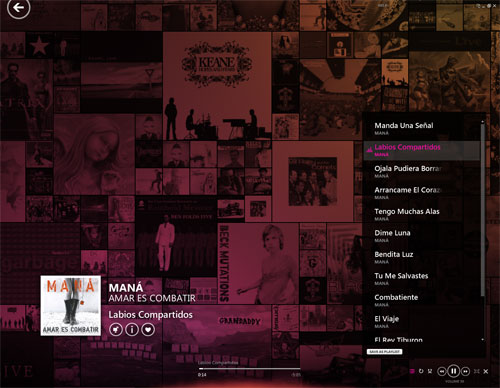
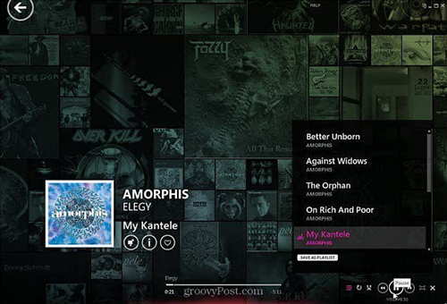

# Spune

> Web-based Spotify "Now Playing" visualizer, inspired by the Zune desktop software.




## Overview

Spune displays album artwork from related artists in a Zune-style mosaic while you listen to Spotify. It polls your currently playing track, discovers related artists via Last.fm and ListenBrainz, and renders their album covers as an animated background.

### Stack

- **Client**: React 19, Vite, React Router v7, plain CSS
- **Server**: Node.js 22, Express, Passport.js (Spotify OAuth), PostgreSQL
- **APIs**: Spotify Web API, Last.fm, ListenBrainz/MusicBrainz
- **CI/CD**: GitHub Actions, Docker

## Getting Started

### Prerequisites

- [Node.js 22+](https://nodejs.org/)
- [PostgreSQL 16+](https://www.postgresql.org/)
- [Spotify Developer Application](https://developer.spotify.com/dashboard)
- (Optional) [Last.fm API key](https://www.last.fm/api/account/create) for better related artist discovery

### Setup

```bash
git clone git@github.com:cdtinney/spune.git
cd spune
npm install
```

Create `packages/server/.env` from the example:

```bash
cp packages/server/.env.example packages/server/.env
```

Edit `.env` and fill in your credentials:

| Variable | Required | Description |
|----------|----------|-------------|
| `DATABASE_URL` | Yes | PostgreSQL connection string |
| `SESSION_SECRET` | Yes | Express session secret (any random string) |
| `SPOT_CLIENT_ID` | Yes | Spotify app client ID |
| `SPOT_CLIENT_SECRET` | Yes | Spotify app client secret |
| `SPOT_REDIRECT_URI` | Yes | OAuth callback URL. Dev: `http://127.0.0.1:3000/api/auth/spotify/callback` |
| `CLIENT_HOST` | Yes | Client origin for redirects. Dev: `http://127.0.0.1:3000` |
| `PORT` | No | Server port (default: 5000) |
| `LAST_FM_API_KEY` | No | Last.fm API key for similar artist discovery |

**Important**: Spotify only supports `127.0.0.1` (not `localhost`) for local development redirect URIs. Add `http://127.0.0.1:3000/api/auth/spotify/callback` to your Spotify app's redirect URIs in the [developer dashboard](https://developer.spotify.com/dashboard).

### Running (Development)

```bash
npm run dev
```

This starts both the Express server (port 5000) and Vite dev server (port 3000) concurrently. Open `http://127.0.0.1:3000`.

The Vite dev server proxies `/api` requests to the Express server, so the redirect URI must point to port 3000 (not 5000) for the session cookie to work correctly.

### Testing

```bash
npm run client:test         # Client tests (Vitest)
npm run client:lint          # Client lint (ESLint)
npm run server:test:coverage # Server tests (Jest)
npm run server:lint          # Server lint (ESLint)
```

### Building

```bash
npm run client:build   # Builds to packages/client/build/
```

## Docker

### Local Development with Docker

```bash
docker compose up
```

This starts the app + PostgreSQL. The database migration runs automatically. Open `http://localhost:5000`.

You must set the Spotify env vars. Either export them or create a `.env` file in the project root:

```bash
SPOT_CLIENT_ID=your-client-id
SPOT_CLIENT_SECRET=your-client-secret
SPOT_REDIRECT_URI=http://localhost:5000/api/auth/spotify/callback
SESSION_SECRET=your-secret
```

## Production Deployment (DigitalOcean Droplet)

CI auto-builds and pushes a Docker image to `ghcr.io` on every merge to `master`. Your droplet auto-updates via Watchtower.

### 1. Set up the droplet

Create an Ubuntu 24.04 droplet (1GB RAM is enough). Open the **Droplet Console** in the DigitalOcean dashboard and run the setup script:

```bash
curl -fsSL https://raw.githubusercontent.com/cdtinney/spune/master/scripts/setup-droplet.sh | bash
```

The script installs Docker, creates `/opt/spune` with a `docker-compose.yml` and `.env`, and generates random secrets.

### 2. Configure credentials

Log in to GitHub Container Registry so the droplet can pull the Docker image:

1. Go to https://github.com/settings/tokens and create a **classic** personal access token with the `read:packages` scope.
2. Run this on the droplet, replacing the placeholders:

```bash
echo "ghp_yourTokenHere" | docker login ghcr.io -u your-github-username --password-stdin
```

Edit `/opt/spune/.env` and fill in your Spotify + Last.fm credentials:

```bash
nano /opt/spune/.env
```

### 3. Point your domain to the droplet

In your DNS provider, add an **A record** pointing your domain to the droplet's IP address:

| Type | Name | Value |
|------|------|-------|
| A | `@` (or subdomain, like `spune`) | `YOUR_DROPLET_IP` |

**If using Cloudflare**: set the proxy status to **DNS only** (grey cloud icon, not orange). Caddy handles SSL — Cloudflare's proxy will conflict with it.

### 4. Start and run migrations

```bash
cd /opt/spune
docker compose up -d
```

Wait for PostgreSQL to be ready, then run migrations:

```bash
curl -fsSL https://raw.githubusercontent.com/cdtinney/spune/master/scripts/migrate.sh | bash
```

### 5. Add HTTPS with a custom domain

```bash
curl -fsSL https://raw.githubusercontent.com/cdtinney/spune/master/scripts/setup-caddy.sh | bash -s your-domain.com
```

This adds Caddy as a reverse proxy with automatic Let's Encrypt TLS certificates and updates `.env` with the correct redirect URIs.

**Don't forget**: add `https://your-domain.com/api/auth/spotify/callback` to your Spotify app's redirect URIs in the [developer dashboard](https://developer.spotify.com/dashboard).

### How auto-deploy works

1. You merge a PR to `master`
2. CI runs tests, builds, and pushes `ghcr.io/cdtinney/spune:latest`
3. Watchtower (on your droplet) detects the new image within 60 seconds
4. It pulls the image and restarts the app container automatically

### Debugging

Open the **Droplet Console** in the DigitalOcean dashboard, then:

```bash
cd /opt/spune

# View app logs
docker compose logs --tail 100 app

# Follow logs in real-time
docker compose logs -f app

# Check container status
docker compose ps

# Check if the app responds
curl -s http://localhost:5000/api/auth/user
```

### Common issues

**"Internal Server Error" after login**: The Spotify redirect URI in your `.env` doesn't match what's registered in the Spotify dashboard. They must be identical.

**"DB_PASSWORD variable is not set"**: The `.env` file is missing `DB_PASSWORD`. Check with `cat /opt/spune/.env | grep DB_PASSWORD`.

**Database connection errors after changing `DB_PASSWORD`**: Postgres stores the password on first start. If you change it later, you must reset the volume:

```bash
cd /opt/spune
docker compose down -v
docker compose up -d
# Wait ~10 seconds, then re-run migrations:
curl -fsSL https://raw.githubusercontent.com/cdtinney/spune/master/scripts/migrate.sh | bash
```

**Browser security warning on bare IP**: Use a domain with HTTPS (step 5) instead of a bare IP address.

**Login redirects back to home page**: The session cookie isn't being set. Check that `SPOT_REDIRECT_URI` and `CLIENT_HOST` use the same origin (same protocol, domain, and port).

## Inspiration

1. Desktop Zune software is awesome to look at on your TV
2. Desktop Spotify software sucks to look at on your TV
3. Therefore, a client that shows what you're listening to in the style of Zune must be awesome
